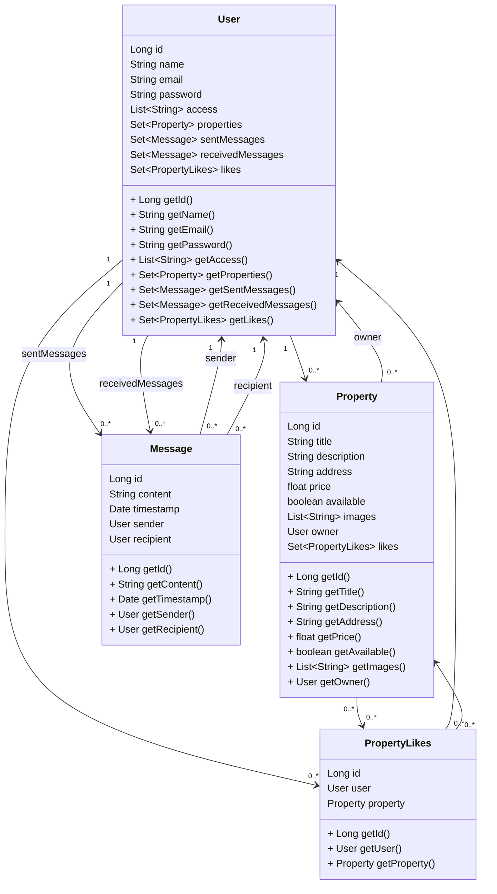

# Aluimoveis Api

```mermaid
classDiagram
    class User {
    Long id
    String name
    String email
    String password
    List~String~ access
    Set~Property~ properties
    Set~Message~ sentMessages
    Set~Message~ receivedMessages
    Set~PropertyLikes~ likes
    + Long getId()
    + String getName()
    + String getEmail()
    + String getPassword()
    + List~String~ getAccess()
    + Set~Property~ getProperties()
    + Set~Message~ getSentMessages()
    + Set~Message~ getReceivedMessages()
    + Set~PropertyLikes~ getLikes()
    }

    class Property {
        Long id
        String title
        String description
        String address
        float price
        boolean available
        List~String~ images
        User owner
        Set~PropertyLikes~ likes
        + Long getId()
        + String getTitle()
        + String getDescription()
        + String getAddress()
        + float getPrice()
        + boolean getAvailable()
        + List~String~ getImages()
        + User getOwner()
    }

    class Message {
        Long id
        String content
        Date timestamp
        User sender
        User recipient
        + Long getId()
        + String getContent()
        + Date getTimestamp()
        + User getSender()
        + User getRecipient()
    }

    class PropertyLikes {
        Long id
        User user
        Property property
        + Long getId()
        + User getUser()
        + Property getProperty()
    }

    User "1" --> "0..*" Property
    User "1" --> "0..*" Message : sentMessages
    User "1" --> "0..*" Message : receivedMessages
    User "1" --> "0..*" PropertyLikes

    Property "0..*" --> "1" User : owner
    Property "0..*" --> "0..*" PropertyLikes

    Message "0..*" --> "1" User : sender
    Message "0..*" --> "1" User : recipient

    PropertyLikes "0..*" --> "1" User
    PropertyLikes "0..*" --> "1" Property
```
