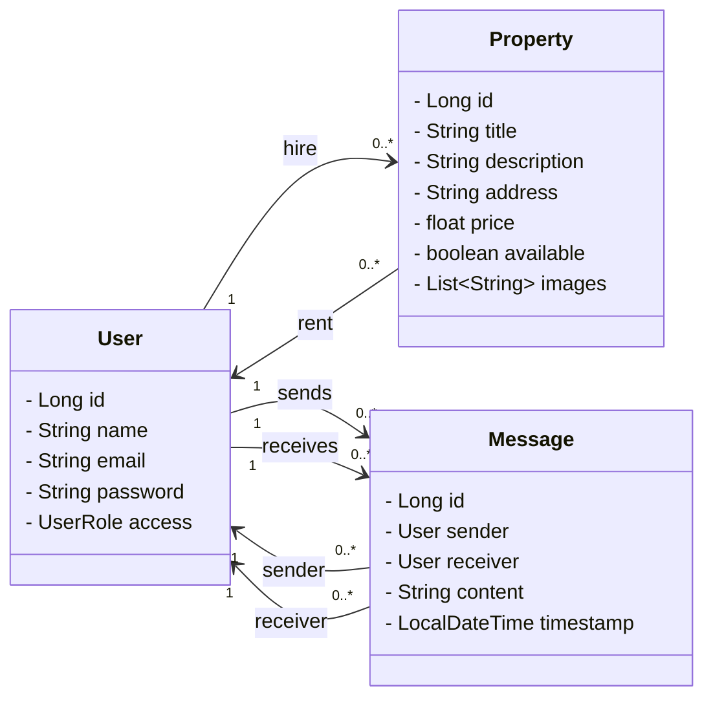
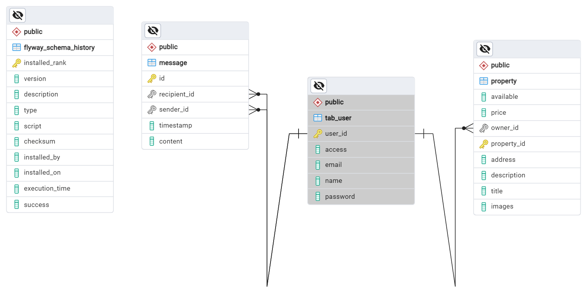

# Aluimoveis Api



## Visão Geral

A AluImoveis API é uma aplicação desenvolvida em Java usando Spring Boot 3, destinada a facilitar a comunicação e interação entre proprietários de imóveis e usuários interessados em alugar. A aplicação permite que proprietários publiquem imóveis, enquanto usuários podem visualizar, enviar mensagens e interagir com esses anúncios.

## Funcionalidades

- Autenticação e Autorização:

Usuários podem se registrar e fazer login, com diferentes níveis de acesso (proprietários e usuários regulares).
- Gerenciamento de Imóveis:
 
Proprietários podem adicionar, editar e remover anúncios de imóveis.
Interação entre Usuários: Usuários podem enviar mensagens para os proprietários sobre os imóveis de interesse.

- Listagem de Imóveis:
 
Todos os usuários podem visualizar uma lista de imóveis disponíveis para aluguel.

## Tecnologias Utilizadas
- Java 17
- Spring Boot 3
- PostgreSQL
- Azure Blob para armazenamento de imagens
- Flyway para gerenciamento de migrações de banco de dados
- Spring Security com JWT para autenticação e autorização
- OpenAPI e Swagger para documentação da API
- Gradle para gerenciamento de dependências e build

## Como Executar
Pré-requisitos
- Java 17
- PostgreSQL
- Gradle
- Azure blob storage


### Clonar o Repositório:

```bash
git clone https://github.com/seu-usuario/aluimoveis-api.git
cd aluimoveis-api
```
### Configurar variaveis de ambiente:

Atualize as configurações do banco de dados e blob nas variaveis de ambiente:

```properties
    DATABASE_PASSWORD=senha_banco_de_dados;
    DATABASE_URL=jdbc:postgresql://localhost:5432/seu_banco;
    DATABASE_USERNAME=seu_usuario
    AZURE_TOKEN=seu_token_gerado_no_azure
    AZURE_URL=url_gerado_no_azure
    JWT_SECRET=sua_chave_secreta_para_jwt
```

### Executar as Migrações de Banco de Dados:

Flyway será executado automaticamente ao iniciar a aplicação para aplicar as migrações.

Construir e Executar a Aplicação:

```bash
Copiar código
./gradlew bootRun
```
### Acessar a Documentação da API:
A documentação da API estará disponível em http://localhost:8080/documentation.

## Uso
Endpoints Principais
- `/users` - Endpoints relacionados a usuários (registro, login, etc.).
- `/properties` - Endpoints para gerenciamento de imóveis.
- `/messages` - Endpoints para envio e recebimento de mensagens.
- `/post` - Endpoint para obter as publicações de imoveis
- `Contribuição`
Contribuições são bem-vindas! Sinta-se à vontade para abrir issues e pull requests.

## Licença

Este projeto está licenciado sob a Licença MIT - veja o arquivo  [LICENSE](licence) para mais detalhes.
